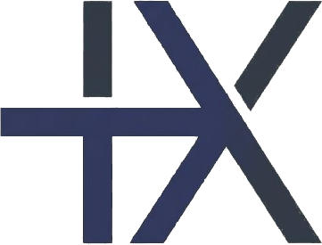

<p align="center">
  
</p>

<h1 align="center">Theoremis</h1>

<p align="center">
  <strong>The AI-powered formal verification platform.</strong><br/>
  Write proofs in LaTeX. Verify with Lean 4. Ship machine-checked mathematics.
</p>

<p align="center">
  <a href="https://theoremis.com">Website</a> ·
  <a href="https://theoremis.com/#ide">IDE</a> ·
  <a href="https://theoremis.com/#playground">Playground</a> ·
  <a href="https://theoremis.com/#api">API</a> ·
  <a href="https://theoremis.com/#pricing">Pricing</a> ·
  <a href="https://theoremis.com/#changelog">Changelog</a>
</p>

<p align="center">
  
  
  
  
  
</p>

---

## What is Theoremis?

Theoremis is the bridge between informal mathematics and machine-checked proofs. It parses LaTeX, performs mutation-based hypothesis testing, emits Lean 4 / Coq / Isabelle code, and verifies proofs through a live Lean bridge — all from your browser.

```
LaTeX theorem → Parse → Type-check → Mutate → Emit Lean 4 → Verify via kernel
```

### Key Features

- **🔬 Formal Verification** — Lean 4 kernel-truth verification via isolated worker sandbox
- **🤖 AI Tactic Hints** — Multi-provider LLM suggestions (OpenAI, Anthropic, Gemini)
- **📊 Hypothesis Testing** — QuickCheck-style mutation analysis with 7 operators
- **⚖️ Axiom Budget** — Track LEM, Choice, Funext per declaration
- **📐 Multi-Target Emission** — Lean 4 (Mathlib-aware), Coq, Isabelle/HOL
- **🎓 Classroom Auto-Grading** — Rubric-based proof assessment

## Surfaces

| Surface | URL | Purpose |
|---------|-----|---------|
| **Web IDE** | [theoremis.com/#ide](https://theoremis.com/#ide) | Full editor with verification, axiom tracking, dependency graph |
| **Playground** | [theoremis.com/#playground](https://theoremis.com/#playground) | Quick theorem analysis — no setup |
| **API** | [theoremis.com/#api](https://theoremis.com/#api) | REST endpoints for verification + translation |
| **Classroom** | [theoremis.com/#classroom](https://theoremis.com/#classroom) | Auto-grader for proof submissions |
| **Pricing** | [theoremis.com/#pricing](https://theoremis.com/#pricing) | Free / Pro / Team / Enterprise tiers |
| **CLI** | `npx tsx cli/lint.ts` | Hypothesis linter for `.tex` files |
| **VS Code** | `vscode-extension/` | Editor integration |
| **GitHub Action** | `github-action/` | CI gate for `.tex` PRs |

## Quick Start

```bash
git clone https://github.com/adamouksili/theoremis.git
cd theoremis
npm install

npm run dev      # Dev server → http://localhost:5173
npm test         # 467 tests
npm run bench    # Benchmark suite with precision/recall
```

## Open-Core Model

Theoremis is **open source** (MIT) at its core. The cloud platform at [theoremis.com](https://theoremis.com) adds managed infrastructure on top.

| Open Source (MIT) | Cloud (theoremis.com) |
|---|---|
| Parser, type-checker, IR | Managed Lean verification fleet |
| Emitters (Lean 4 / Coq / Isabelle) | User accounts + proof persistence |
| Mutation engine + evaluator | Team workspaces + classroom analytics |
| CLI + VS Code extension | Priority queue + caching |
| Core API handlers | AI model fine-tuning |
| Landing, IDE, Playground | Billing, SSO, audit logs |

> **Free forever for open-source research.** The core engine is MIT-licensed and always will be.

## Architecture

~15,000 lines of TypeScript. 467 tests. Zero runtime dependencies beyond KaTeX.

```
src/
├── core/         # λΠω IR (18 term variants), type-checker, axiom tracking
├── parser/       # LaTeX recursive descent, LLM hypothesis extraction
├── engine/       # Mutation operators, BigInt evaluator, counterexample generator
├── emitters/     # Lean 4 (Mathlib-aware), Coq, Isabelle/HOL
├── formal/       # Lean bridge, verification queue, obligation counter
├── bridge/       # Lean server, Mathlib DB, Moogle search
├── api/          # Pipeline orchestration, grading, serialization
├── ide/          # Web IDE, landing, playground, classroom, pricing, changelog
└── styles/       # CSS design system
```

## Benchmark

| Metric | Hypothesis Detection | Mutation Detection |
|--------|--------------------:|-------------------:|
| Precision | **100.0%** | **93.3%** |
| Recall | **100.0%** | **100.0%** |
| F1 | **100.0%** | **96.6%** |

## Contributing

We welcome contributions! See [CONTRIBUTING.md](CONTRIBUTING.md) for guidelines.

**High-impact areas:** Lean 4 emitter improvements, new mutation operators, LaTeX parser coverage, test fixtures, documentation.

## Security

Found a vulnerability? Please email **adam@theoremis.com** instead of opening a public issue. See [SECURITY.md](SECURITY.md).

## License

[MIT](LICENSE) — free forever for the open-source core.

---

<p align="center">
  Built by <a href="https://github.com/adamouksili">Adam Ouksili</a> at Rutgers University
</p>
