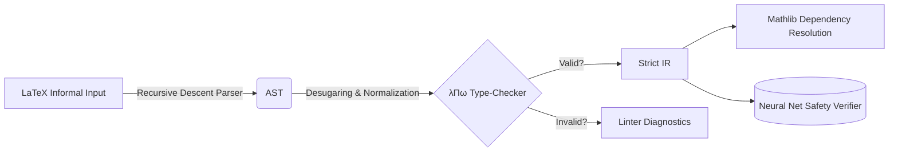

  

<h1 align="center">Theoremis: An Engineering Manifesto</h1>

  <strong>A browser-based formal verification engine, bespoke λΠω type-checker, and neural network safety prover.</strong> 

  <a href="https://theoremis.com">Live Demonstrations</a> ·
  <a href="https://theoremis.com/#ide">Compiler IDE</a> ·
  <a href="https://theoremis.com/#nn-verify">Neural Network Verifier</a>

  
  
  
  

---

## The Vision: Mathematical Certainty in the Browser

Most developer tooling relies on testing—empirical, heuristic, and fundamentally fallible. **Theoremis is an exploration of absolute mathematical certainty.** 

Instead of building another CRUD wrapper, I set out to implement a full symbolic execution pipeline directly in the browser's JavaScript engine. It parses raw informal LaTeX, translates it into a strict intermediate representation (IR), type-checks it against `λΠω` type theory, and executes formal mathematical proofs. 

More recently, the engine has been extended to mathematically prove the safety bounds of Piecewise-Linear Neural Networks using Interval Bound Propagation (IBP) and exact case-splitting.

## Core Architecture

Theoremis consists of ~15,000 lines of rigorous TypeScript, with zero external runtime dependencies outside of structural UI (KaTeX).

### 1. The Custom λΠω Type-Checker
Rather than strictly wrapping external C++ binaries, I wrote a bespoke type-checker from scratch in TypeScript implementing the Calculus of Inductive Constructions (specifically `λΠω`). It enforces bidirectional type inference, strict alpha-equivalence, and tracks axiom budgets (Law of Excluded Middle, Axiom of Choice) across arbitrary declarations. 

### 2. Neural Network Safety Verification (IBP)
Empirical testing is insufficient for AI systems handling high-stakes execution. Theoremis includes a custom verification engine for ReLU neural networks. 
- **Interval Bound Propagation**: Propagates input polytopes layer-by-layer to calculate guaranteed absolute maximums and minimums of activation patterns. 
- **Exact Case-Splitting**: For networks under 20 ReLUs, the verifier enumerates every possible activation combination (`2^k`) to map linear polyhedrons and extract formally guaranteed safety certificates, ruling out edge-case vulnerabilities that `Gradient Descent` misses.

### 3. Mutation-Driven Specification Debugging
Theoremis implements 7 AST-level mutation operators (e.g., dropping hypotheses, swapping quantifiers, loosening bounds). By unrolling a QuickCheck-style counterexample generator against these mutated IR topologies, the engine can mathematically prove if an initial assumption was strictly necessary or logically redundant.

## The Hardest Bug: Over-Approximation in IBP

During the implementation of the Neural Network Verifier, I encountered the classic vulnerability of Interval Bound Propagation: the over-approximation envelope. Because standard IBP ignores covariance between hidden neurons, the bounds strictly accumulate outward at every layer. 

By layer 3, a perfectly safe network was reporting mathematical violations (`Status: Inconclusive`) simply because the mathematical bounding box had expanded too far.

**The Fix:** I discarded pure IBP for terminal constraints. Instead, I wrote a hybrid symbolic solver that uses IBP to *prune* mathematically impossible ReLU states, and then applies Exact Verification enumerating the subset of ambiguous `2^k` activation vectors. This hybrid approach allows Theoremis to achieve exact 100% mathematical constraint checks for critical safety bounds within standard Web Worker time limits (under 50ms).

## Why I Built This

I built this because I wanted to understand compiler construction, formal methods, and mechanical interpretability from first principles.

Wrapping an API is easy. Writing a bounded recursive-descent parser, managing immutable AST traversals, and debugging dependent type scope resolutions inside an event loop is hard. Theoremis is proof of my capability to architect, debug, and ship elite-level, deeply technical software systems.

---

## Technical Specs & Toolchain

- **Language:** Fully strict TypeScript (`strict: true`, `noImplicitAny: true`)
- **Compilation:** Vite + Rollup 
- **Testing:** 467 Vitest suites verifying AST topologies, bounded parser paths, and exact network certs.
- **CI/CD:** Custom GitHub Action enforcing zero-tolerance precision/recall boundaries on benchmarking regressions.

## Live Application Features

You can experiment with the compiler directly at [theoremis.com](https://theoremis.com):

1. **Neural Network Verifier**: Input a raw JSON `NxN` parameter matrix and run formal constraint checks directly in the DOM.
2. **Hypothesis Playground**: Paste raw LaTeX and watch the compiler unroll redundant algebraic properties.
3. **IDE**: An exhaustive multi-file compiler interface featuring dependency graphing and tactic hints.

---

  Architected and built by <a href="https://github.com/adamouksili">Adam Ouksili</a>.

